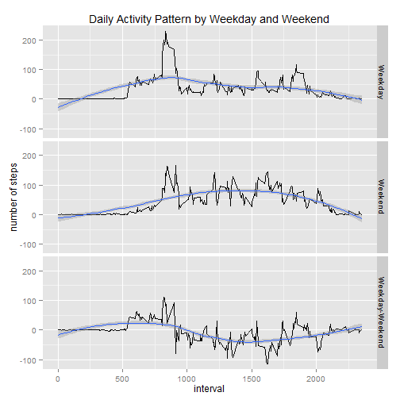

Reproducible Research: Peer Assesment 1
========================================================

## 1. Loading and preprocessing the data
The data is loaded from the file activity.csv, which must be located in the working directory/data/ (set up your working directory properly)

```r
library(reshape2)
data<-read.csv("./data/activity.csv",stringsAsFactor=FALSE)
data$date<-as.Date(data$date)
```

## 2. What is mean total number of steps taken per day?
For this section I have used only the valid data of steps (NAs are filtered out of the data)

```r
daily<-dcast(melt(data,id="date",measure.vars="steps"),date~variable,sum)
hist(daily$steps, main="Daily Steps Count", xlab="",ylab="Number of Steps", col="steel blue")
```

 

```r
meanNA <- mean(daily$steps,na.rm=TRUE)
medianNA <- median(daily$steps,na.rm=TRUE)
```
The mean total number of steps taken per day is: 1.0766 &times; 10<sup>4</sup>,  and the median is: 10765.


## 3. What is the average daily activity pattern?
We see that the average daily activity pattern has almost no steps between the 0h and up to a bit more than 5h, after that the average number of steps increase up to about 200 around the 8h, then the steps decline at an average of about 50 steps to finally decrease at around the 20 hours.

```r
intervalavg<- dcast(melt(data,id=c("date","interval"), measure.vars="steps", na.rm=TRUE), interval~variable,mean)

plot(intervalavg$interval,intervalavg$steps,type="l", main="Daily Activity Pattern", ylab="Steps", xlab="Interval",col="steel blue")
```

 

```r
maxSteps<- max(intervalavg$steps)
intervalMax <- intervalavg[intervalavg$steps==maxSteps,1]
```
The interval with the maximum number of steps throughout the day is 835 with a total steps of 206.1698


## 4. Imputing missing values

### 4.1 Total number of missing values in the dataset

```r
missings<- sum(is.na(data$steps))
```
The total number of missing values in the dataset is: 2304
### 4.2 Fill up the NA values of steps
I proceed to fill up the NA values of steps with the mean of the interval period, be that 5, 10, 15, etc. creating a new dataset called "datacomplete" that contains the same information of the original dataset.  
I chose the average per interval to complete the NAs because the average per day would add distortion to the daily activity pattern, particularly in the valley around the 0 to 5 hours.


```r
datacomplete<-data

for (i in 1:nrow(datacomplete)) {
    if (is.na(datacomplete[i,1])) {
      datacomplete[i,1] = intervalavg[match(data[i,3],intervalavg$interval),2]
    }
}
```

### 4.3. Analysis of the missing values
I create a histogram with the data with the completed NA values of the previous step and calculate the mean and median to compare to the previously calculated without completing the NAs.

```r
dailycomplete<-dcast(melt(datacomplete,id="date",measure.vars="steps"),date~variable,sum)
hist(dailycomplete$steps, main="Daily Steps Count", xlab="",ylab="Number of Steps", col="dark green")
```

 

```r
meannoNA <- mean(dailycomplete$steps,na.rm=TRUE)
mediannoNA <- median(dailycomplete$steps,na.rm=TRUE)
```
The mean with completed NAs is: 1.0766 &times; 10<sup>4</sup>  
The median with completed NAs is: 1.0766 &times; 10<sup>4</sup>

The addition of the mean by interval for the missing values from the dataset does not change the mean, however, it does change slightly the median, being the difference between the new and old 1.1887 or 0.011% which is less than 1% making the difference insignificant.

## 5. Are there differences in activity patterns between weekdays and weekends?
I proceed to subset add the field of weekend or weekend using the weekdays() formula.

```r
datacomplete$day <- weekdays(datacomplete$date)
datacomplete$weekday <- datacomplete$day
for (i in 1:nrow(datacomplete)) {
    if (datacomplete[i,4]=="Saturday") {
        datacomplete[i,5] = "Weekend"
    } else if (datacomplete[i,4]=="Sunday") {
        datacomplete[i,5] = "Weekend"
    } else {
        datacomplete[i,5] = "Weekday"
    }
}
intervalwkday<- dcast(melt(datacomplete,id=c("date","interval","weekday"), measure.vars="steps"), interval+weekday~variable,mean)
intervalwkday$weekday<- as.factor(intervalwkday$weekday)

a<-intervalwkday[intervalwkday$weekday=="Weekday",]
a$steps<-intervalwkday[intervalwkday$weekday=="Weekday",3]-intervalwkday[intervalwkday$weekday=="Weekend",3]
a$weekday<-"Weekday-Weekend"
intervalwkday<-rbind(intervalwkday,a)
```

Then I proceed to make a plot with a loess smooth to review the differences of daily activity pattern between weekday and weekend using ggplot2 library.

```r
library(ggplot2)
qplot(interval,steps,data=intervalwkday, geom="line",xlab="interval",ylab="number of steps",main="Daily Activity Pattern by Weekday and Weekend")+facet_grid(weekday~.)+geom_smooth(aes(group=1),method="loess")
```

 


After observing the weekday and weekend daily activity patterns we can see that in average the weekday and weekday are different.  During weekdays there is a big momentum around the 8hour and then the pattern is very small around 50 steps. However, during the weekend it is more consistent with what seems an average of around 80 steps throughout the day. Also it seems to start a bit later at around 9hours rather than at around the 5hours during the weekdays.

## Environment of analysis
This work was produced using the following:

```r
sessionInfo()
```

```
## R version 3.1.0 (2014-04-10)
## Platform: i386-w64-mingw32/i386 (32-bit)
## 
## locale:
## [1] LC_COLLATE=English_United States.1252 
## [2] LC_CTYPE=English_United States.1252   
## [3] LC_MONETARY=English_United States.1252
## [4] LC_NUMERIC=C                          
## [5] LC_TIME=English_United States.1252    
## 
## attached base packages:
## [1] stats     graphics  grDevices utils     datasets  methods   base     
## 
## other attached packages:
## [1] ggplot2_1.0.0 reshape2_1.4  knitr_1.6    
## 
## loaded via a namespace (and not attached):
##  [1] colorspace_1.2-4 digest_0.6.4     evaluate_0.5.5   formatR_0.10    
##  [5] grid_3.1.0       gtable_0.1.2     labeling_0.2     MASS_7.3-33     
##  [9] munsell_0.4.2    plyr_1.8.1       proto_0.3-10     Rcpp_0.11.1     
## [13] scales_0.2.4     stringr_0.6.2    tools_3.1.0
```
